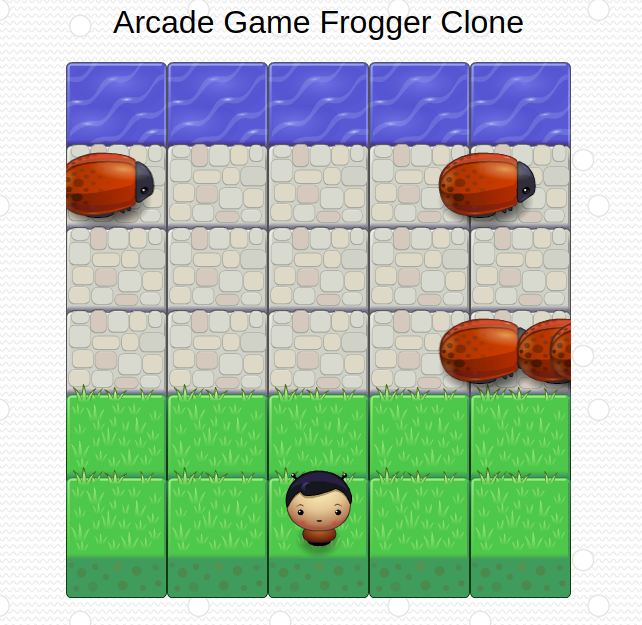

# Udacity FEND Arcade Game Frogger Clone Project :video_game:

Arcade Game Frogger Clone is a Single Page App

This project is from my Front-End Web Developer Nanodegree Program at Udacity. This project is based on the classic arcade game [Frogger](https://en.wikipedia.org/wiki/Frogger).

The goal of the game is to reaches the water (i.e. top of the game board), the game is won. The challenge is to avoid the bugs that travel on the road. If a bug is touched, the character is reset back at the beginning.

## Table of Contents

  - [Get Started](#Get\ Started)
  - [Motivation](#Motivation)
  - [Lesson Learned](#What\ I\ learned\ from\ this\ project)
  - [Screenshot](#Screenshot)
  - [Installation](#Installation)
  - [How to Use?](#How\ to\ Use?)
    - [Mobile phone users](#Mobile\ phone\ users\ :iphone:)
  - [Technology Used](#Technology\ Used)
  - [Contributing](#Contributing)

## Get Started
Click on this link to see the website or you can download or clone the project, and loading up the index.html file in your browser.

##  Motivation
Games have a lot of objects and those objects do a lot of different things; but sometimes they do some very similar things as well. This creates a great opportunity for me to practice object-oriented programming, an important programming paradigm that influences application architecture and provides performance optimization.

## What I learned from this project
During the project, I learned complex applications that must be “broken down” into simpler entities that manage their own properties and functionality. I also learned JavaScript’s object oriented programming features to write eloquently designed classes capable of creating countless instances of similarly functioning objects.

## Screenshot

## Installation
- You can download the zip or clone the project with git
- Install [Node.js](https://nodejs.org/) by following the instructions on the website.
- Run `npm install` inside the project
- Run `npm start` afterwards
- Good Luck! :thumbsup:

## How to Use?
- Use the keyboard arrow keys to move player left, right, up and down
- Press *C* to change the player character
### Mobile phone users :iphone:
- Users swipe on screen to move the player
- Users touch on screen to change the player character

## Technology Used
* Vanilla JS
* HTML5 and CSS3
* CSS Animation [animate.css](https://daneden.github.io/animate.css) - A cross-browser library of CSS animations.
* Animated Modal [animatedModal.js](https://joaopereirawd.github.io/animatedModal.js) - animatedModal.js is a jQuery plugin to create a fullscreen modal with CSS3 transitions.
* Hammer.js [HAMMER.JS](http://hammerjs.github.io) - A javascript library for multi-touch gestures

## Contributing
Contributions are always welcome! Please read the [contribution guidelines]() first.